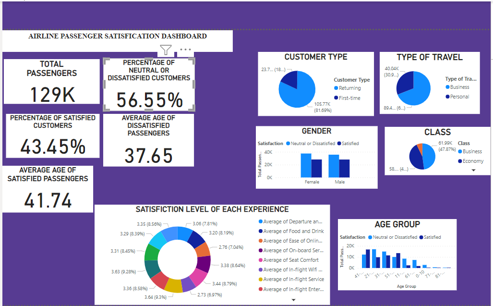

# Airline-Passenger-Satisfactory Analysis

## Introduction
This is a powerBI project on passrnger satisfaction analysis from a hypothetical **Dano Airline Passenger Satisfaction**.The project is to provide valuable insights into passenger satisfaction, identify key factors that influence passengers satisfaction level, extract meaningful insights that will enable airlines to make informed decisions and improved their services.

**-Disclaimer_**:_All Datasets report is based on available data, do not represent any passenger and airline, but just a practice dataset to demonstrate the capabilities of PowerBI._

## Problem Statement
1 Analyze the total number of passengers surveyed or within a specific timeframe.

2 Calculate the percentage of passengers who reported being satisfied with their experience.

3 Determine the mean age of passengers who reported satisfaction.

4 Calculate the percentage of passengers who were either neutral or dissatisfied.

5 Identify the mean age of passengers who reported dissatisfaction.

6 Analyze satisfaction levels for different travel purposes like business, leisure, etc.
- *Gender:* Assess how satisfaction levels vary between male and female passengers.
- *Class:* Explore satisfaction levels across different classes - economy, business, first class.

7 Evaluate satisfaction regarding various experiences - booking process, check-in, onboard services, etc.

8 Segment satisfaction levels based on age groups to identify patterns
  
## Skills Demonstrated
-DAX
-New Measures
-Filters
-Modelling

## Modelling
Use statistical models to analyze satisfaction factors and predict future trends.

## Visualization
Use graphs, charts, and visual representations to illustrate satisfaction levels across different segment
Interact with the report [here](https://app.powerbi.com/links/mWfcFi7Fn0?ctid=de77f51d-cfea-4fc7-b51a-311a7821fd4a&pbi_source=linkShare)
## Analysis

### Airline Passenger Satisfactory Analysis

## Conclusions and Recommendation
The analysis provides crucial insights into a more profounding understanding of passengers desires,Onboard services and staff interactions received the highest satisfaction scores among passengers,Booking processes and baggage handling showed lower satisfaction scores, requiring immediate attention,Business travelers generally displayed higher satisfaction than leisure travelers across most service aspects.

### Recommendations
-Streamline and simplify booking processes to improve passenger experience during the initial stages of travel.
-Implement strategies to expedite baggage handling and minimize passenger inconvenience.
- Focus on further enhancing staff interactions to maintain and exceed the high satisfaction levels already achieved.
- Develop personalized services specifically targeting the preferences of leisure travelers to elevate their satisfaction levels.
- - Establish mechanisms for ongoing passenger feedback to address evolving needs and maintain service excellence.

Implementing these recommendations target actionable steps to enhance overall passenger satisfaction and experience.

**THANK YOU!**

